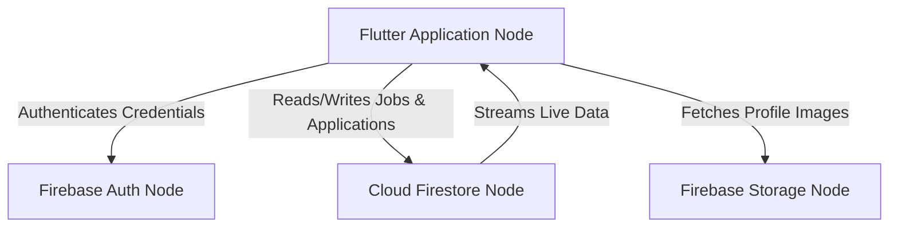
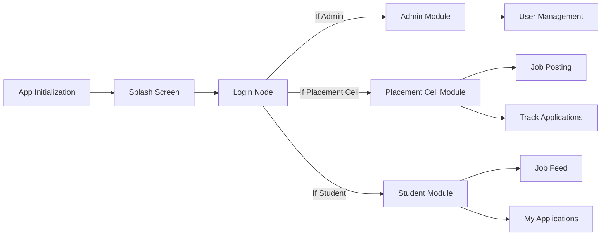
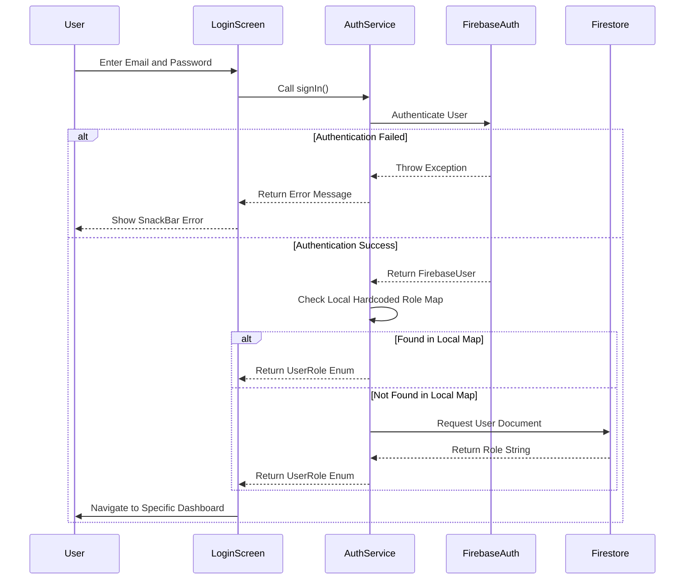
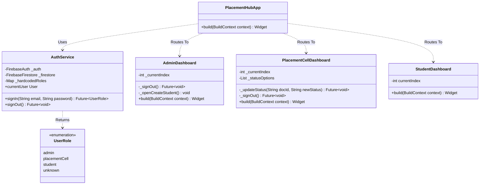

This document contains visual representations of the Placement Portal system. It utilizes Mermaid syntax to define Class, Sequence, Block, and Architecture diagrams.

See [[Architecture]] for textual explanations of these diagrams.

## Architecture Diagram

This diagram shows the high level components of the system and how the Flutter frontend interacts with Firebase Backend services.

## Block Diagram

This block diagram demonstrates the module hierarchy and how the application routes users based on their authenticated role.

## Sequence Diagram

This sequence diagram details the login process. It highlights how the application utilizes a local lookup map before relying on a database call.

## Class Diagram

This diagram displays the relationship between primary classes, specifically focusing on the authentication service and the dashboard structures.

